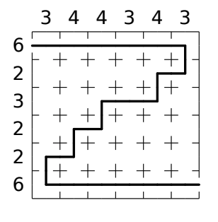
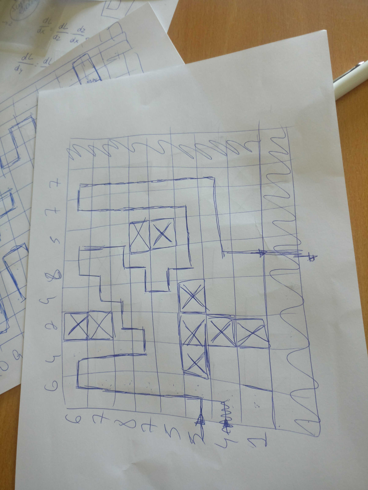
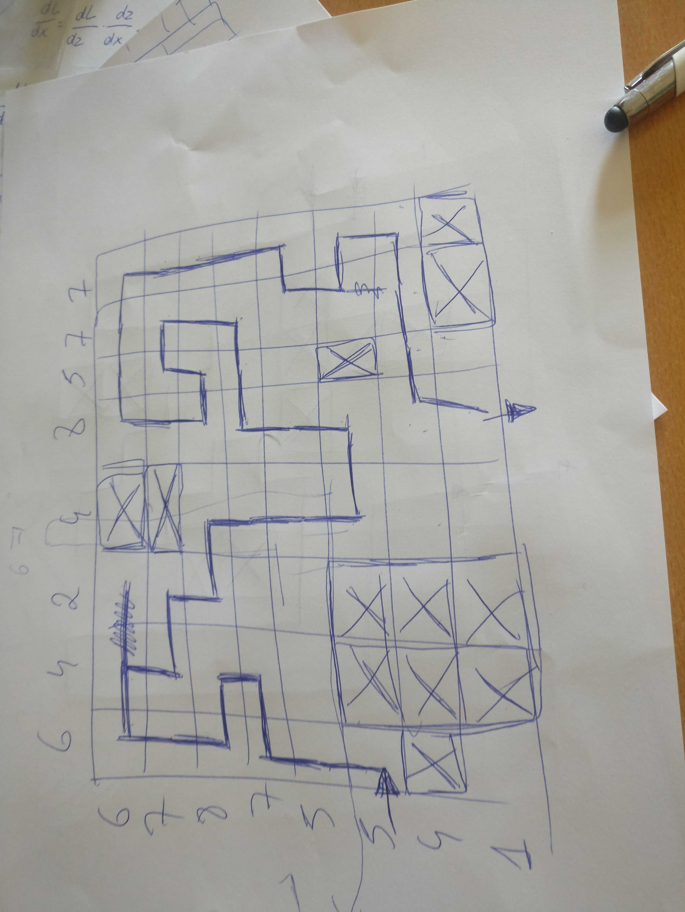

# Discrete Tomography

This problem is inspired by this [Path Puzzles: Discrete Tomography with a Path Constraint is Hard](https://erikdemaine.org/papers/PathPuzzles_JCDCGGG2017/paper.pdf) by Erik Demaine. It is also an attempt to start using Prolog more frequently and getting used to it.

 The probem can be considered as a puzzle consists of a (rectangular) grid of cells with two exits (or “doors”) on the boundary and numerical constraints on some subset of the rows and columns. A solution consists of a single non-intersecting path which starts and ends at two boundary doors and which passes through a number of cells in each constrained row and column equal to the given numerical clue. For example:
 
 
 
 The input for this example would follow this structure:

```
6 # size of a side of the square
3 4 4 3 4 3 # input of the X axis
6 2 3 2 2 6 # inputs of the Y axis
0 0 # starting point
6 6 # goal
```

and here your output:

```
(0,0), (1,0), (2,0), (3,0), (4,0), (5,0), (5,1), (4,1), (4,2), (3,2), (2,2), (2,3), (1,3), (1,4), (0,4), (0,5), (1,5), (2,5), (3,5), (4,5), (5,5) 
```

## First problem
Input of the first problem:
```
6 
5 3 3 4 3 5 
5 3 5 1 5 4
0 5
1 0 
```
The solution can be found at first.pl. 
```prolog
?- [first].
true.
?- go(0,5,1,0,[w(0,5)],Path,[1,0,0,0,0,0], [0,0,0,0,0,1]).
Final path:[w(0,5),w(0,4),w(1,4),w(2,4),w(2,5),w(3,5),w(4,5),w(4,4),w(5,4),w(5,3),w(5,2),w(5,1),w(5,0),w(4,0),w(3,0),w(3,1),w(3,2),w(2,2),w(1,2),w(0,2),w(0,1),w(0,0),w(1,0)]
```

## Second problem
Now we have some cells that we should avoid in our path. Notice that if we did not insert some cells to be avoided we could have several good results, for example this two would be valid for the question (the real solution is the one in the right):
<p align="center">
</img>
</img>
</p>

Let's try with a bigger one, input:
```
8
6 4 2 4 8 5 7 7
6 7 8 7 5 5 4 1
0 5
7 6
# cells to be avoided (x,y)
3 1 
5 5 
0 6
1 6 
0 7
2 6 
2 7
7 7 
6 7
1 5
2 5
1 7
2 6 
```
The solution can be found at second.pl. 
```prolog
?- [corona].
true.

?- go(0,5,4,7,[w(0,5)],Path,[1,0,0,0,0,0,0,0], [0,0,0,0,0,1,0,0]).
Final path:[w(0,5),w(0,4),w(0,3),w(1,3),w(1,2),w(0,2),w(0,1),w(0,0),w(1,0),w(1,1),w(2,1),w(2,2),w(3,2),w(3,3),w(3,4),w(3,5),w(4,5),w(4,4),w(4,3),w(5,3),w(6,3),w(6,2),w(6,1),w(5,1),w(5,2),w(4,2),w(4,1),w(4,0),w(5,0),w(6,0),w(7,0),w(7,1),w(7,2),w(7,3),w(7,4),w(6,4),w(6,5),w(7,5),w(7,6),w(6,6),w(5,6),w(4,6),w(4,7)]
```
